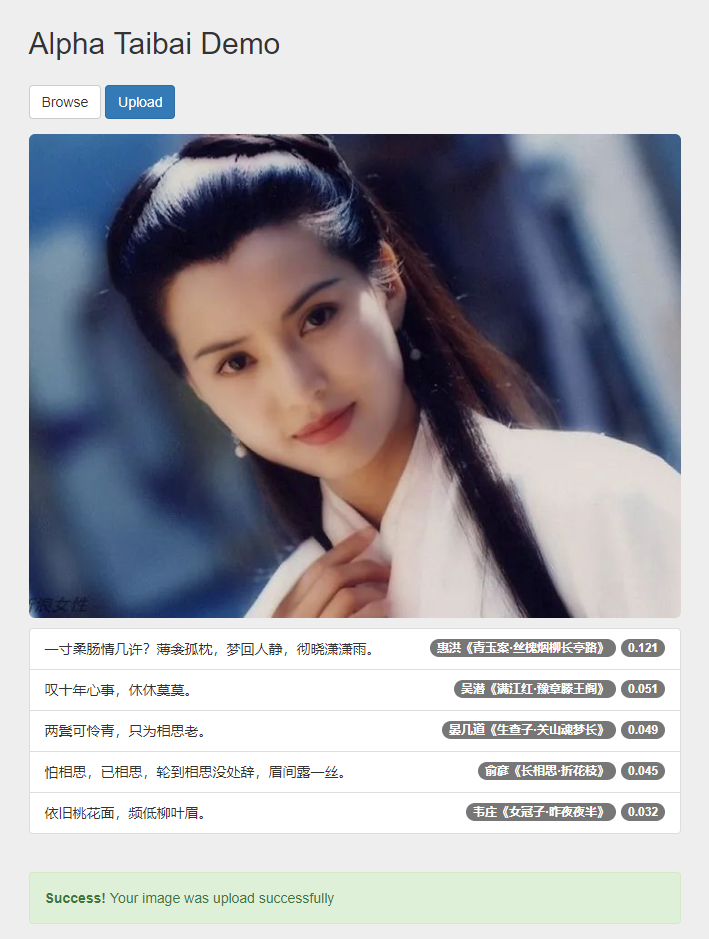

# AlphaTaiBai
An AI Poet AlphaTaiBai automatically compose poems for your modern words, voices, pictures and even videos. It makes you become literary quickly.

[Portal](http://www.alphataibai.com)

 

 

 

## Resources
* [中国古诗文网](http://www.gushiwen.org/) 可以得到翻译和词语注释
* [中华古诗词数据库Git](http://shici.store/chinese-poetry/) 唐诗5.5w 宋诗 22w 宋词21k, 平仄信息

## Tools
* [古诗文网爬虫](https://github.com/PChief/GushiwenSpider)
* [Jieba 分词](https://github.com/fxsjy/jieba)

## Pretrained Model
* [Chinese-BERT-wwm](https://github.com/ymcui/Chinese-BERT-wwm)
* [Sentence Transformers: Sentence Embeddings using BERT / RoBERTa / XLNet with PyTorch](https://github.com/UKPLab/sentence-transformers#sentence-embeddings-using-bert)
* [huggingface/transformers](https://github.com/huggingface/transformers)

## Related Papers
* [Universal Sentence Encoder](https://arxiv.org/pdf/1803.11175.pdf)
* [Unifying visual-semantic embeddings with multimodal neural language models](https://arxiv.org/pdf/1411.2539.pdf)
* [2018:Finding beans in burgers:Deep semantic-visual embedding with localization](http://openaccess.thecvf.com/content_cvpr_2018/CameraReady/3272.pdf)
* [2014:Unifying visual-semantic embeddings with multimodal neural language models](https://arxiv.org/pdf/1411.2539.pdf)
* [2019:Sentence-BERT: Sentence Embeddings using Siamese BERT-Networks](https://arxiv.org/pdf/1908.10084.pdf)
* [2019:Pre-Training with Whole Word Masking for Chinese BERT](https://arxiv.org/abs/1906.08101)
* [Supervised Multimodal Bitransformers for Classifying Images and Text](https://arxiv.org/pdf/1909.02950.pdf)
* [ViLBERT: Pretraining Task-Agnostic Visiolinguistic Representations for Vision-and-Language Tasks](https://arxiv.org/pdf/1908.02265.pdf)
